# VSDBabySoc
# VSDBabySoc - Design Flow from (RTL to Post Layout Routing)

## Soc

A System on a Chip (SoC) is an integrated circuit that combines most or all essential components of a computer or electronic system onto a single microchip.

Unlike older designs where the CPU, GPU, and memory were mounted separately on a board, an SoC integrates all these components into one chip.

---

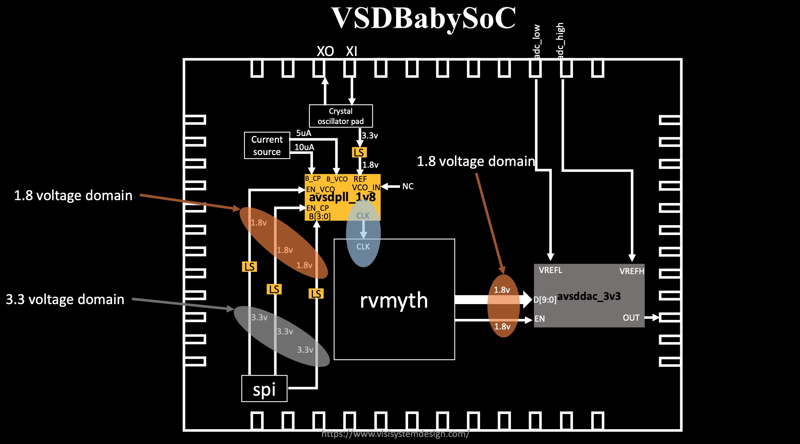
## VSD BabySoC

VSD BabySoC is a small RISC-V–based System-on-Chip designed for open-source chip design learning and experimentation.

It contains:

- RVMyth Microprocessor (CPU)
- 8x PLL (Clock Generation)
- 10-bit DAC (Digital-to-Analog Converter)

---

## RISC-V Core (RVMyth)

RVMyth is a compact RV32I RISC-V processor using a simple 5-stage pipeline: Fetch, Decode, Execute, Memory, Write-Back.

It uses a hardcoded instruction memory to run a small program that updates register x17, which is used as the SoC output for DAC waveform generation.

### RVMyth Interface

| Signal Name | Direction | Width | Purpose |
|-------------|-----------|--------|---------|
| OUT         | Output    | 10-bit | Outputs the value of register x17 for the DAC |
| CLK         | Input     | 1-bit  | System clock for the entire pipeline |
| reset       | Input     | 1-bit  | Resets PCs, registers, and memories |

---

## PLL (avsdpll_1v8)

A Phase-Locked Loop (PLL) produces a stable, controlled clock signal by matching its timing to a reference input. It adjusts continuously to stay synchronized and is commonly used to generate clean, reliable clock frequencies.

### PLL Interface

| Signal Name | Direction | Type | Purpose |
|-------------|-----------|------|---------|
| CLK         | Output    | reg  | Generated PLL output clock |
| VCO_IN      | Input     | wire | External VCO signal input (unused in this model) |
| ENb_CP      | Input     | wire | Charge-pump enable (unused here) |
| ENb_VCO     | Input     | wire | Enables or disables VCO clock generation |
| REF         | Input     | wire | Reference clock for frequency measurement |
| period      | Internal  | real | Stores current output clock period |
| lastedge    | Internal  | real | Timestamp of previous REF rising edge |
| refpd       | Internal  | real | Computed reference clock period |

### Code Explanation

1. **Reference Clock Measurement**  
   On every REF rising edge, the time difference from the previous edge is measured, giving the reference period.

2. **VCO Frequency Adjustment**  
   The PLL sets its oscillation period to one-eighth of the reference period:  
   `period = refpd / 8.0`

3. **Clock Generation Loop**  
   When ENb_VCO is 1, the clock toggles every half-period. When 0, the clock is forced low.

4. **ENb_CP Signal**  
   Present for compatibility with analog models but unused here.

5. **Toggle Assignment Explanation**  
   `CLK <= (CLK === 1'b0);`  
   Toggles the clock: 0 becomes 1, any other value becomes 0.

---

## DAC (avsddac_3v3)

A Digital-to-Analog Converter (DAC) converts a digital binary value into a corresponding analog voltage, enabling digital systems to interface with analog signals.

### DAC Interface

| Signal | Type | Purpose |
|--------|------|---------|
| OUT    | real output | The analog voltage generated by the DAC |
| D      | 10-bit input | Digital input value to be converted |
| VREFH  | real input   | High reference voltage |
| VREFL  | real input   | Low reference voltage |
| Dext   | wire         | Zero-extended version of D |
| EN     | wire         | DAC enable signal |
| NaN    | real         | Invalid value indicator |

### Code Explanation

The DAC converts a 10-bit value (D) into an analog voltage between VREFL and VREFH.

- D is zero-extended to ensure proper numerical handling.
- Output voltage uses the formula:  
  `OUT = VREFL + (D / 1023) * (VREFH - VREFL)`
- The output updates whenever D, EN, or reference voltages change.
- Invalid reference inputs produce a NaN output to prevent incorrect analog values.

This module acts as a simple behavioral DAC mapping a digital code to an analog voltage.

## Cloning VSD BabySoC

    cd > verilogfiles
    git clone https://github.com/manili/VSDBabySoC.github

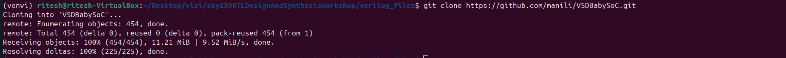

### Modules inside VSDBabySoC ( VSDBabySoC/src/module/):


- avsddac.v
Contains the behavioral model of a DAC that converts a 10-bit digital input into an analog voltage using reference levels.

- avsdpll.v
Implements a simplified behavioral PLL model that generates a clock whose frequency tracks the reference input.

- rvmyth.v
The RISC-V processor core (RVMyth), handling instruction fetch, decode, execute, memory, and write-back stages.

- vsdbabysoc.v
Top-level SoC integration file that connects the RVMyth CPU, DAC, PLL, and other modules into a complete system.

- testbench.v
Simulation testbench that drives inputs, monitors outputs, and verifies the behavior of the entire SoC design.

## Converstion of .tlv to .v (using sandpiper-saas ):


### Steps to Install sandpiper  :

1: Install the venv(virtual environment) package 

    sudo apt update
    sudo apt install python3.12-venv

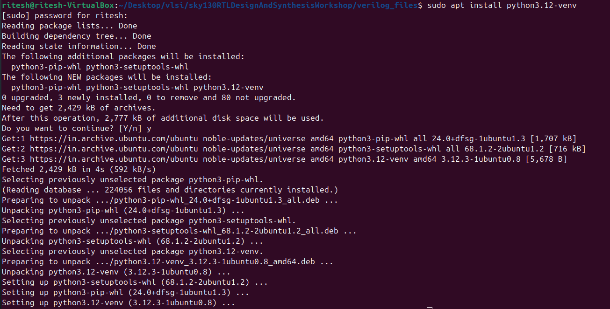

2: Move to your project directory

    cd ~/Desktop/vlsi/sky130RTLDesignAndSynthesisWorkshop

3: Create a virtual environment

    python3 -m venv venv

4: Activate the virtual environment

    source venv/bin/activate

5: Install SandPiper-SaaS 

    pip install pyyaml click sandpiper-saas

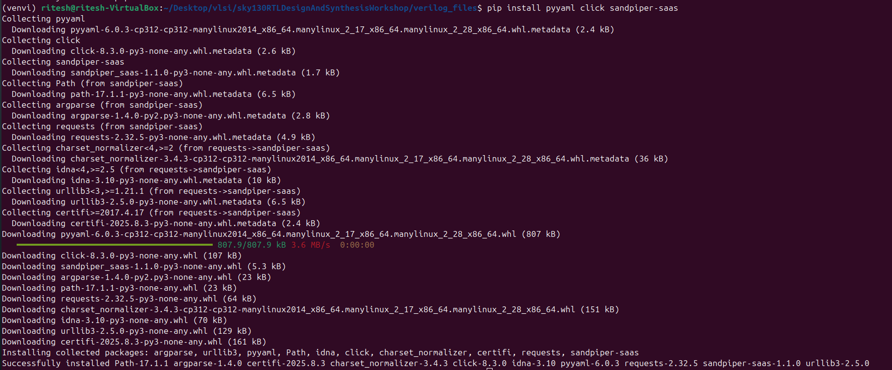

6:Deactivate V-env (when done)

    deactivate

### - Run SandPiper-SaaS to Convert TL-Verilog to Verilog

    cd VSDBabySoC
    sandpiper-saas -i ./src/module/*.tlv -o rvmyth.v --bestsv --noline -p verilog --outdir ./src/module/

    where;

              -i: Input TL-Verilog files

              -o: Output Verilog file name (rvmyth.v)

        --bestsv: Use best SystemVerilog practices

        --noline: Removes debug line directives

      -p verilog: Output format is Verilog

        --outdir: Directory where the output file will be saved

### Converting the rvmyth.tlv to rvmyth.v :

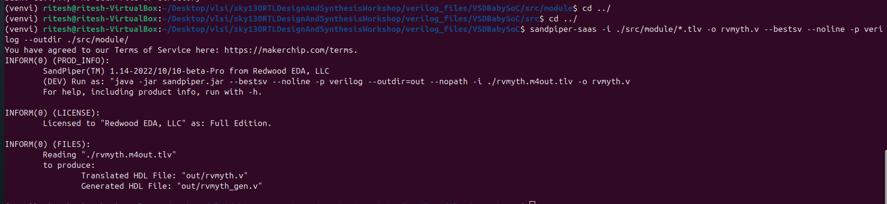

- **After Converstion :**

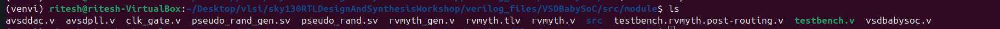

- after the run listing the files in modules the rvmyth.v is created as the converstion of rvmyth.tlv

##  stimulation using Icarus Verilog

1. Create a Directory to Store waveform:

         mkdir -p output/pre_synth_sim

2. Synthesis

         iverilog -o output/pre_synth_sim.out -DPRE_SYNTH_SIM src/module/testbench.v -I src/include -I src/module

| **Section** | **Syntax** | **Description** |
|-------------|------------|------------------|
| **1. Compiler** | `iverilog` | Runs the Icarus Verilog compiler to build the design for simulation |
| **2. Output File** | `-o output/pre_synth_sim.out` | Specifies the output executable generated after compilation |
| **3. Macro Definition** | `-DPRE_SYNTH_SIM` | Defines a preprocessor macro that enables conditional compilation inside Verilog source files |
| **4. Source File** | `src/module/testbench.v` | The main Verilog source file used as the entry point for compilation (usually the testbench) |
| **5. Include Paths** | `-I src/include`, `-I src/module` | Adds directories to the search path for \include` files used inside Verilog code and add verilog files inside module |


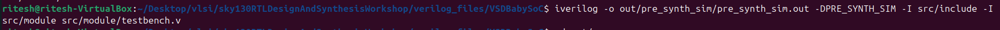


3. Running the output file:

   Moving to Ouptut Directory:

         cd output/pre_synth_sim

   Running the .out file:

         ./pre_synth_sim.out

4. Viewing  Waveform :

         gtkwave pre_synth_sim.vcd

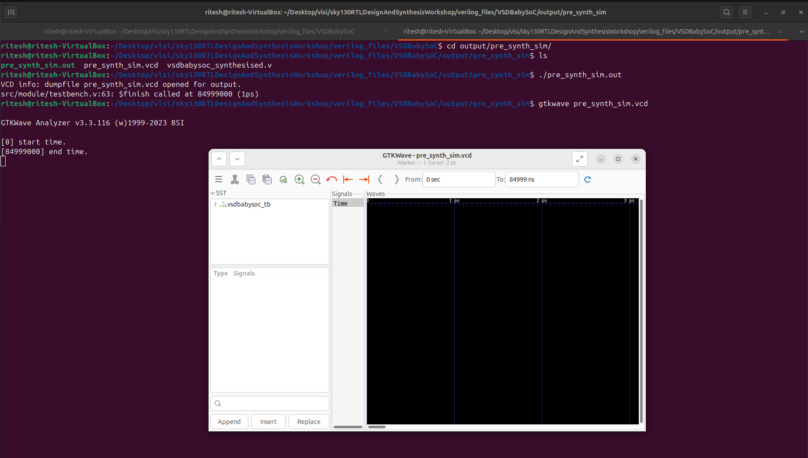

### Output Waveform:

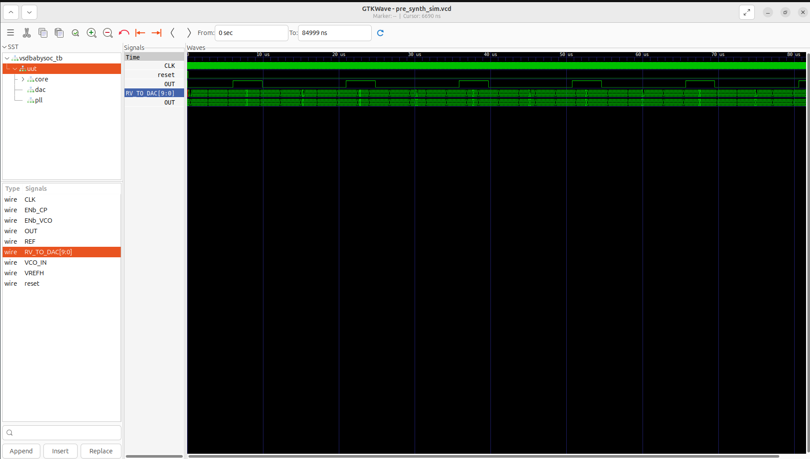

###  Visualize Digital to Analog format:

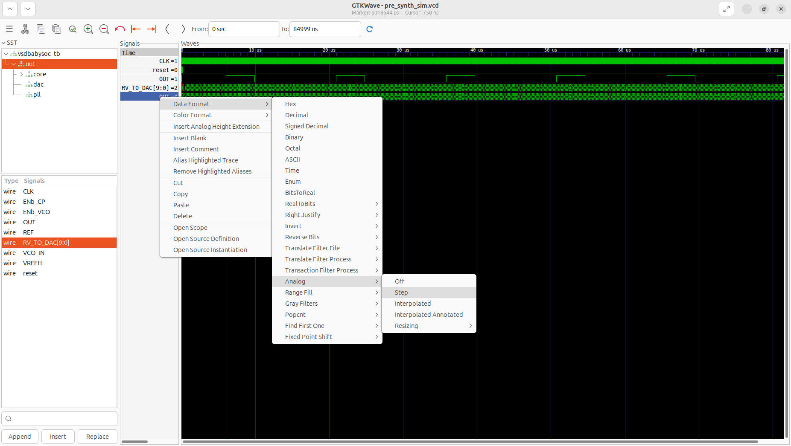

- rightclick on signal -> Data Format -> Analog -> Step

##  Dac  (Digital to Analog) Output:

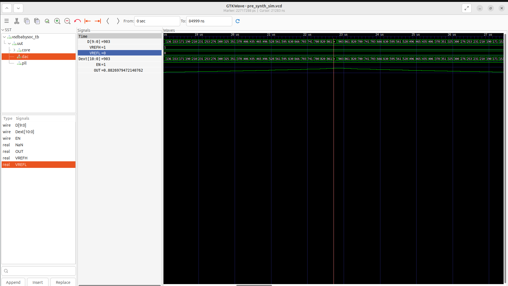

- From the output waveform we can see that as the digital value increses as  the analog signal rises and when digital value decrease analg signal also follows the same.

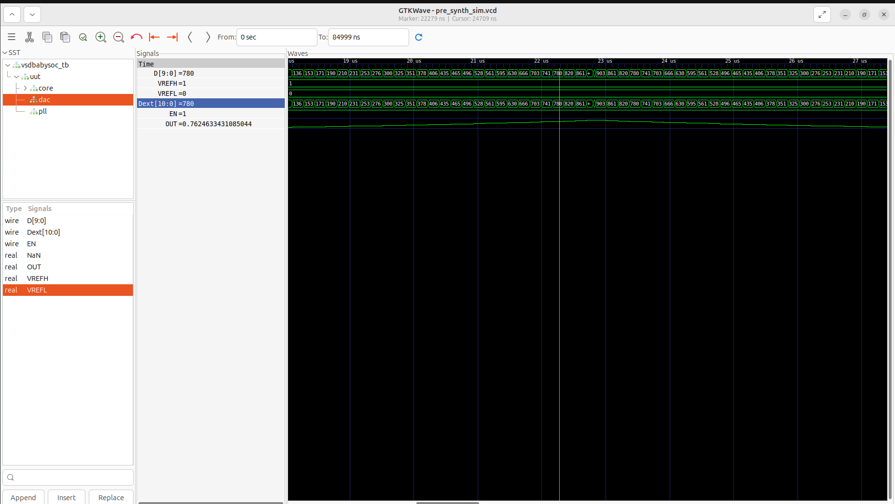

    vout=vrefl+(d/1023)*(vrefh-vrefl)
    vout=0+(780/1023)*(1-0)
    vout=780/1023 = 0.762 v

---

## PLL(Phase Locked Loop):

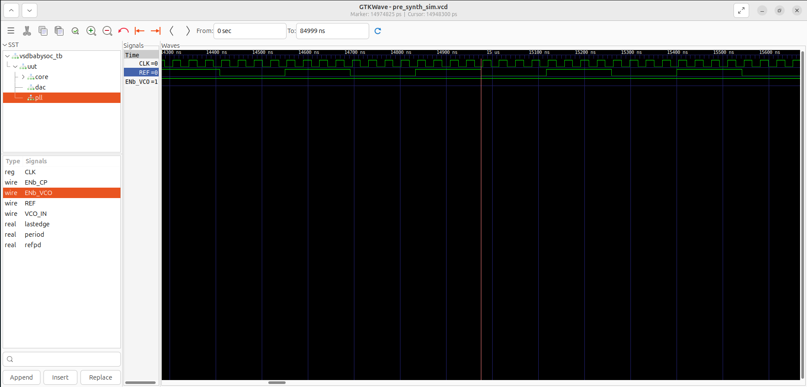

- The waveform shows that when ENb_VCO = 1, the CLK output oscillates according to the input REF frequency, indicating that the PLL successfully generates a stable clock signal synchronized with the reference.The clk generated is multipled by 8 with reference clock. When ENb_VCO = 0, the output will remains low, confirming correct enable control functionality.


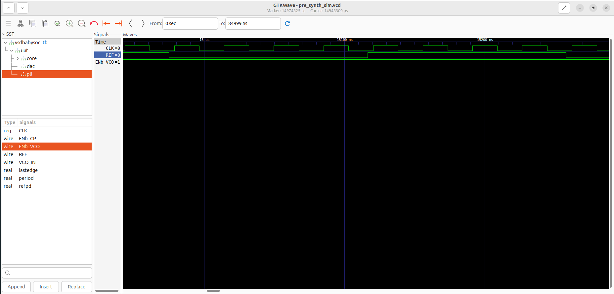

---

## Synthesis:

Synthesis is the process of converting RTL Verilog into a gate-level representation built from a real standard-cell library. It uses the Liberty file to understand the available cells, their functions, timing properties.The output is a gate-level netlist that accurately reflects how the design will be implemented in hardware.

### 1. Yosys (Synthesis):
- Yosys is the open source tool used for transforming Verilog RTL into gate-level designs.It supports a wide range of optimization, analysis, and mapping.

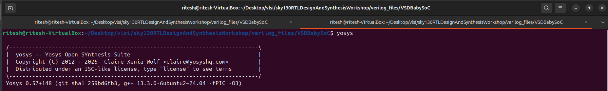

### 2. Loading the Liberty Files
    read_liberty -lib src/lib/sky130_fd_sc_hd__tt_025C_1v80.lib
    read_liberty -lib src/lib/avsdpll.lib
    read_liberty -lib src/lib/avsddac.lib


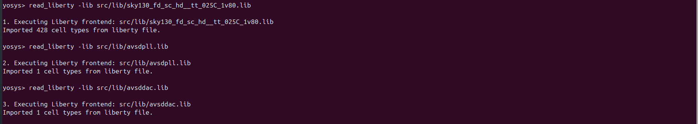

### 3. Loading Verilog Files

    read_verilog src/module/vsdbabysoc.v
    read_verilog -I src/include src/module/rvmyth.v
    read_verilog -I src/include src/module/clk_gate.v

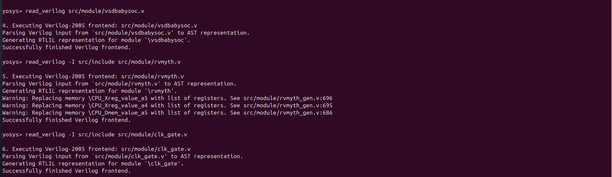

### 4. Run synthesis

    synth -top vsdbabysoc


- Statistics 

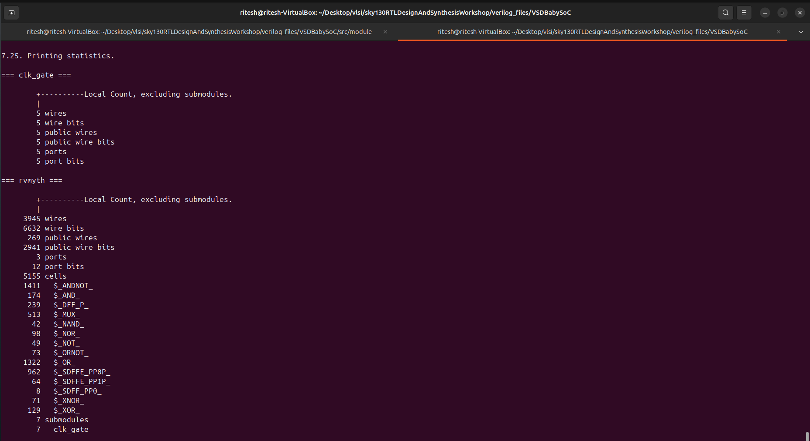
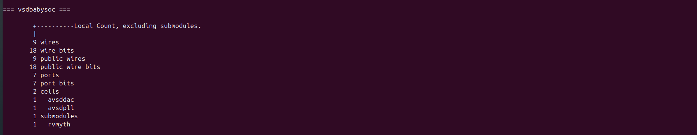
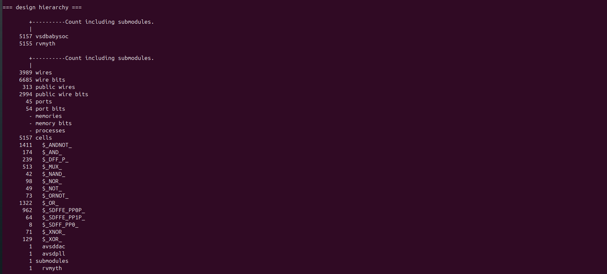

### 5. DFF Library Mapping

    dfflibmap -liberty src/lib/sky130_fd_sc_hd__tt_025C_1v80.lib

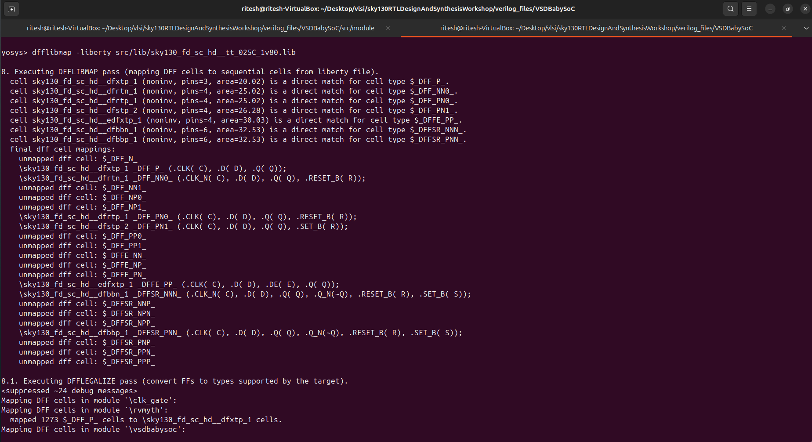

### 6. show (viewing netlist):

    show vsdbabysoc

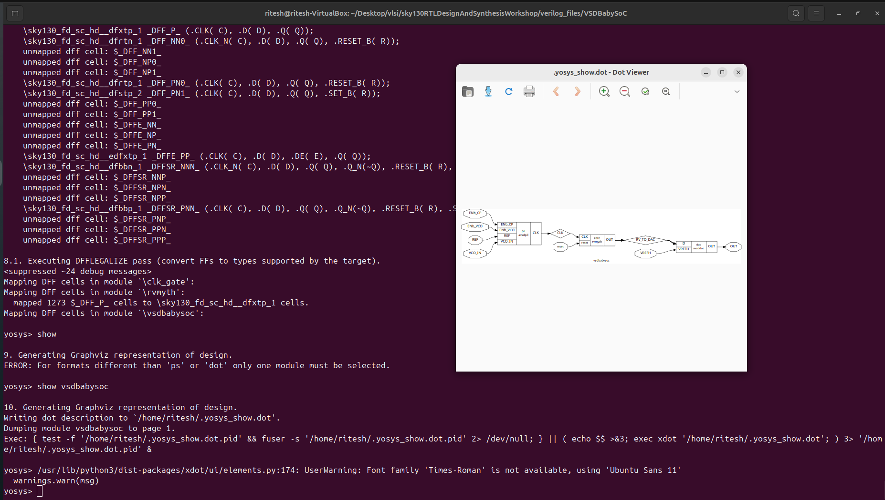
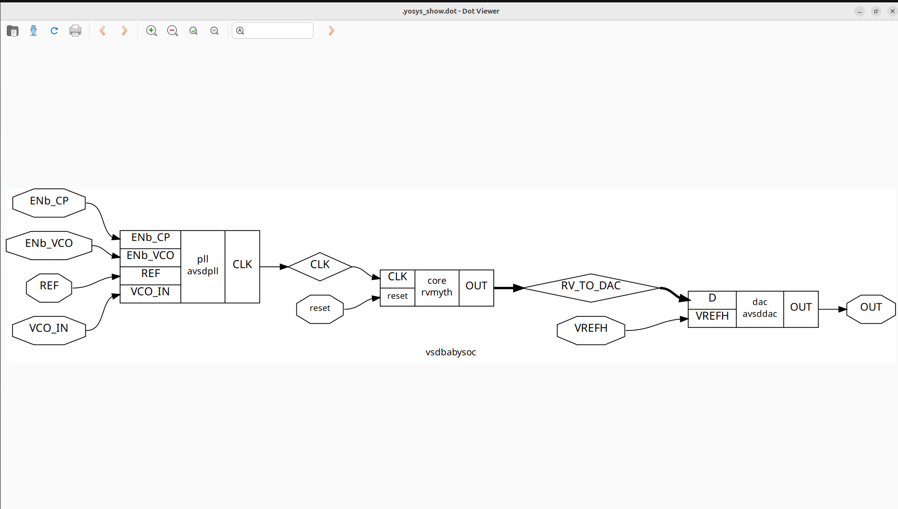

### 7. Logic Optimization and Technology Mapping

    opt
    abc -liberty src/lib/sky130_fd_sc_hd__tt_025C_1v80.lib

### 8. Flattening, Cleaning, and Preparing the Synthesized Design

    flatten
    setundef -zero
    clean -purge
    rename -enumerate

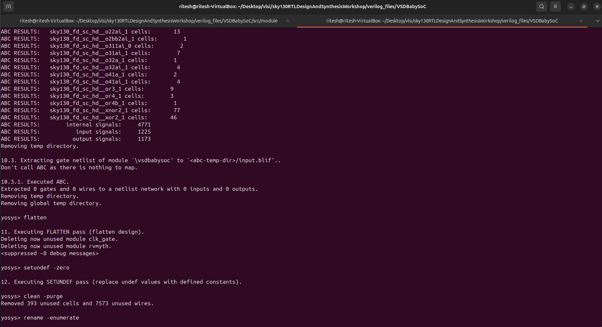

### 9. Viewing Statistics

    stat
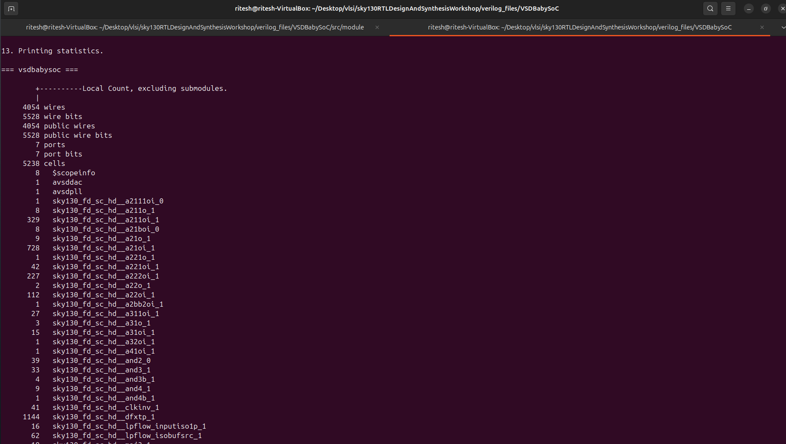
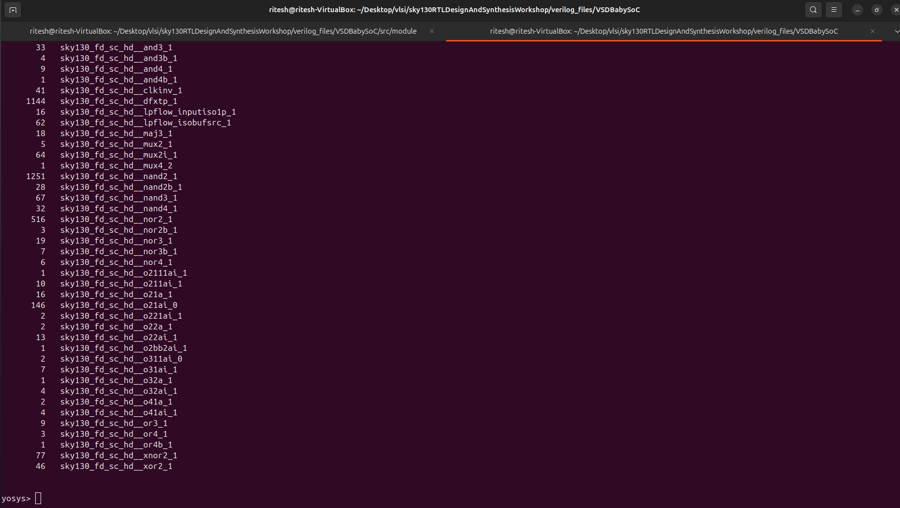

### 10. Write Synthesized Verilog Netlist
- creating directory before write verilog
- ```
    cd output
    mkdir post_synth_sim

- write verilog
```
  write_verilog -noattr output/post_synth_sim/vsdbabysoc.synth.v
```
---

## Gate-Level Simulation (GLS)

- Gate-Level Simulation (GLS) is the process of simulating a synthesized netlist (after RTL is converted into logic gates) to verify that the design behaves correctly at the gate level.

- GLS is performed to check timing, functional correctness, and logic after synthesis, ensuring the final hardware will work as intended before fabrication.

---

### 1. Compiling Gate-Level Netlist with Icarus Verilog

    iverilog -I src/gls_model -I output/post_synth_sim -I src/include -I src/module -o output/post_synth_sim/post_synth_sim.out -DPOST_SYNTH_SIM -DFUNCTIONAL -DUNIT_DELAY=#1 src/module/testbench.v

### 2. Run .out file

    cd output/post_synth_sim
    ./post_synth_sim.out

### 3. Gtkwave - (Viewing vcd file)
    gtkwave post_synth_sim.vcd

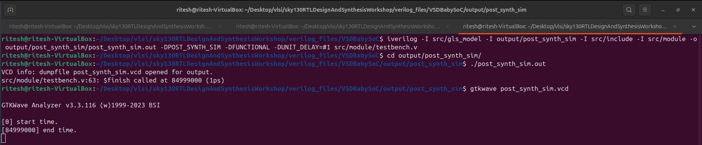

### 

## Synthesis and Waveform:

### 1. Compiling Gate-Level Netlist with Icarus Verilog

    iverilog -I src/gls_model -I output/post_synth_sim -I src/include -I src/module -o output/post_synth_sim/post_synth_sim.out -DPOST_SYNTH_SIM -DFUNCTIONAL -DUNIT_DELAY=#1 src/module/testbench.v

### 2. Running 

    cd output/post_synth_sim
    ./post_synth_sim.out

### 3. Gtkwave
    gtkwave post_synth_sim.vcd


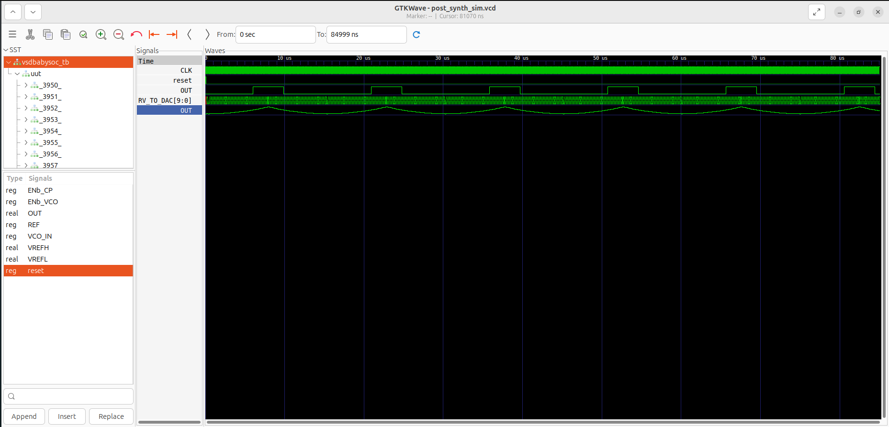

### PreSynthesis vs PostSynthesis(GLS):
**Post Synthesis**


**Pre Synthesis**

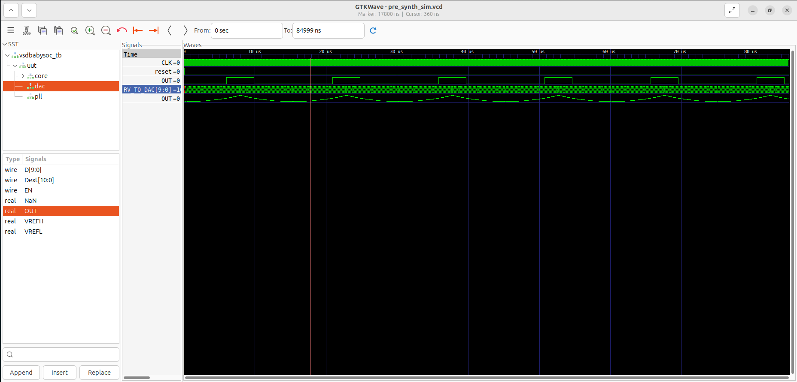


The waveform of both the pre synthesis and post synthesis are similar. Same functionality as the RTL is manintained by the after synthesis (gls)


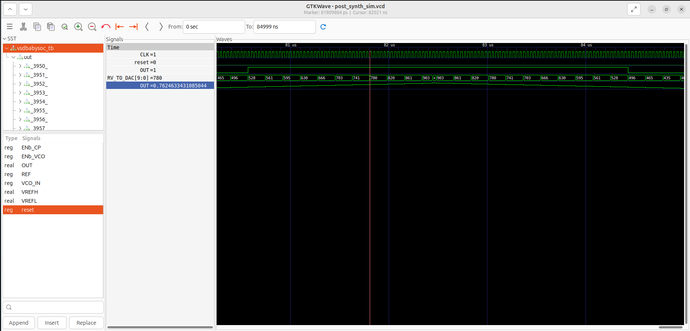

- From the output waveform we can see that as the digital value increses as  the analog signal rises and when digital value decrease analg signal also follows the same.

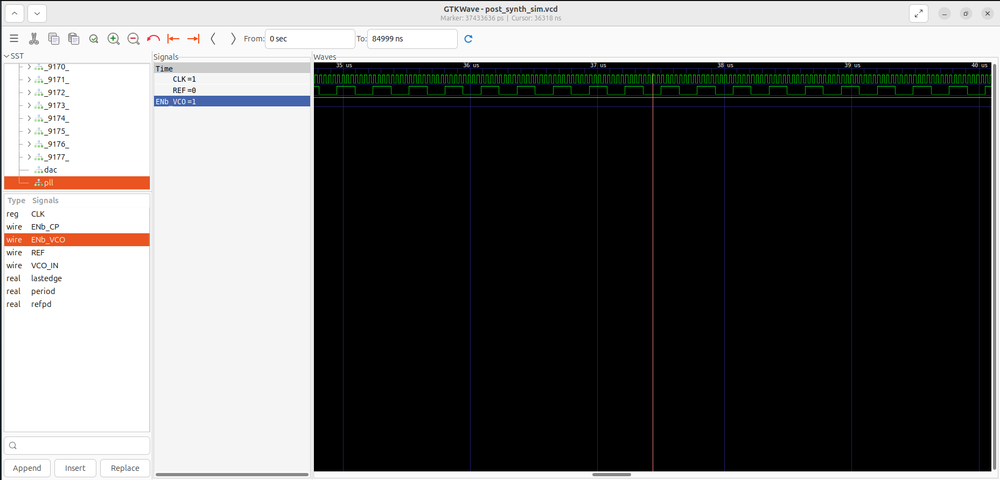

- The waveform shows that when ENb_VCO = 1, the CLK output oscillates according to the input REF frequency, indicating that the PLL successfully generates a stable clock signal synchronized with the reference.The clk generated is multipled by 8 with reference clock. When ENb_VCO = 0, the output will remains low, confirming correct enable control functionality.


## Static Timing Analysis of VSDBabySoC using OpenSTA:


### OpenSTA Installation:

    # Clone the OpenSTA repository
    git clone https://github.com/The-OpenROAD-Project/OpenSTA.git 


    # Navigate into the repository
    cd OpenSTA  

    # Create build directory
    mkdir build

    # navigate to the build directory
    cd build  

    # Configure the build using CMake
    cmake ..  

    # Compile OpenSTA
    make  

    # Install OpenSTA (requires sudo)
    sudo make install

    # checking STA Version
    sta --version

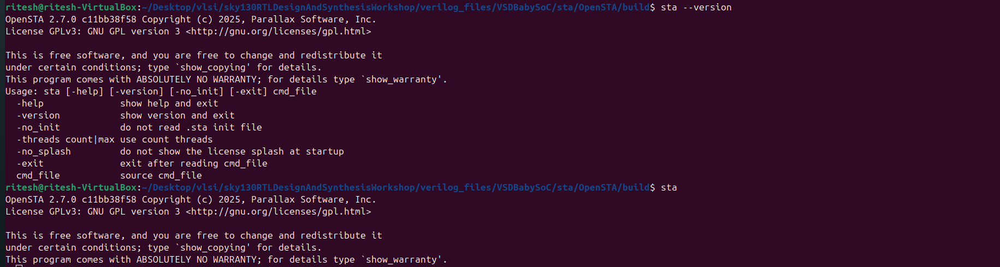

### 3. Prepare Required Files

### 3.1 Timing Libraries

    mkdir -p examples/timing_libs
    cp ../src/lib/*.lib examples/timing_libs/

Files Included:

- sky130_fd_sc_hd__tt_025C_1v80.lib – Standard cell library

- avsdpll.lib, avsddac.lib – IP-specific Library

### 3.2 Synthesized Netlist & Constraints

    mkdir -p examples/BabySoC
    cp ../src/sdc/vsdbabysoc_synthesis.sdc examples/BabySoC/
    cp ../src/verilog/vsdbabysoc.synth.v examples/BabySoC/

### Final Overview of files:


    OpenSTA/
    |____examples/
        |___BabySoC/
        |       ├── cd_sky130hd.sdc
        |       ├── vsdbabysoc_synthesis.sdc
        |       └── vsdbabysoc.synth.v
        |
        |___timing_libs/
                ├── avsddac.lib
                ├── avsdpll.lib
                └── sky130_fd_sc_hd__tt_025C_1v80.lib

### Running min/max timing check:

<details>
<summary><strong>vsdbabysoc_min_max_delays.tcl</strong></summary>

```
    # Load Liberty Libraries
    read_liberty -min ~/Desktop/vlsi/sky130RTLDesignAndSynthesisWorkshop/verilog_files/VSDBabySoC/sta/OpenSTA/examples/timing_libs/sky130_fd_sc_hd__tt_025C_1v80.lib
    read_liberty -max ~/Desktop/vlsi/sky130RTLDesignAndSynthesisWorkshop/verilog_files/VSDBabySoC/sta/OpenSTA/examples/timing_libs/sky130_fd_sc_hd__tt_025C_1v80.lib

    read_liberty -min ~/Desktop/vlsi/sky130RTLDesignAndSynthesisWorkshop/verilog_files/VSDBabySoC/sta/OpenSTA/examples/timing_libs/avsdpll.lib
    read_liberty -max ~/Desktop/vlsi/sky130RTLDesignAndSynthesisWorkshop/verilog_files/VSDBabySoC/sta/OpenSTA/examples/timing_libs/avsdpll.lib

    read_liberty -min ~/Desktop/vlsi/sky130RTLDesignAndSynthesisWorkshop/verilog_files/VSDBabySoC/sta/OpenSTA/examples/timing_libs/avsddac.lib
    read_liberty -max ~/Desktop/vlsi/sky130RTLDesignAndSynthesisWorkshop/verilog_files/VSDBabySoC/sta/OpenSTA/examples/timing_libs/avsddac.lib

    # Read Synthesized Netlist
    read_verilog ~/Desktop/vlsi/sky130RTLDesignAndSynthesisWorkshop/verilog_files/VSDBabySoC/sta/OpenSTA/examples/BabySoC/vsdbabysoc.synth.v

    # Link Top-Level Design
    link_design vsdbabysoc

    # Apply SDC Constraints
    read_sdc ~/Desktop/vlsi/sky130RTLDesignAndSynthesisWorkshop/verilog_files/VSDBabySoC/sta/OpenSTA/examples/BabySoC/vsdbabysoc_synthesis.sdc

    # Generate Timing Report (all checks)
    report_checks 

```

</details>

- command to run:

    sta
    source  ~/Desktop/vlsi/sky130RTLDesignAndSynthesisWorkshop/verilog_files/VSDBabySoC/sta/OpenSTA/examples/BabySoC/vsdbabysoc_min_max_delays.tcl


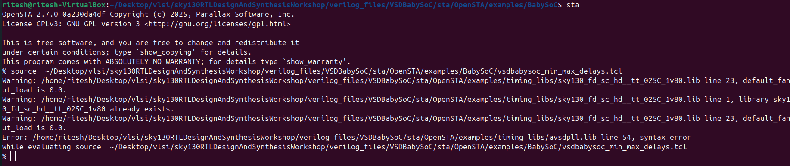

- this error will arise due the inproper command line given in avsdpll.lib file
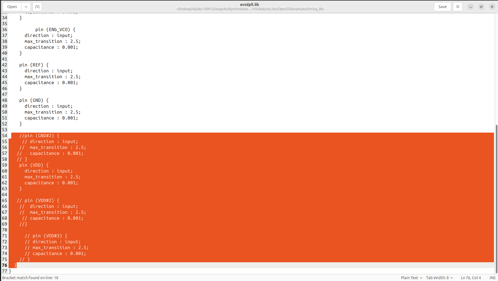

- the single line command line is changes to mutliple line commanad line


### Exectuting the script again:


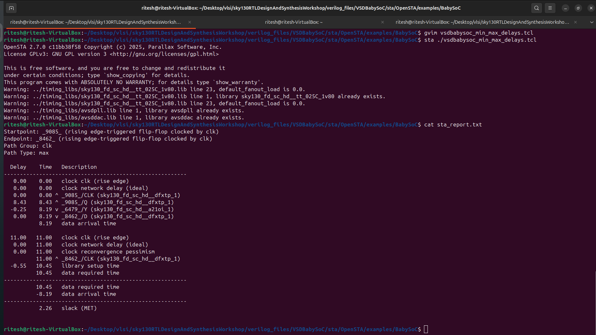

### View Timing Reports

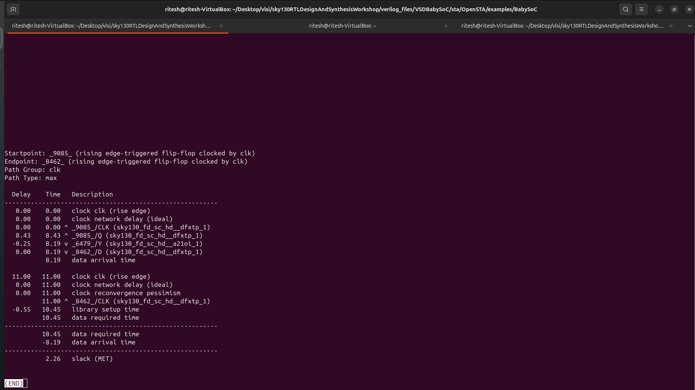

###   PVT Corner Analysis of VSDBabySoc :

- timing librarier is needed to perform this PVT Corner Analysis:

        clone at directory ~/Desktop/vlsi/sky130RTLDesignAndSynthesisWorkshop/verilog_files/VSDBabySoC/sta/OpenSTA/examples/BabySoC/timing_libs

        git clone https://github.com/efabless/skywater-pdk-libs-sky130_fd_sc_hd.git

<details>
<summary><strong>sta_across_pvt.tcl</strong></summary>

```

set list_of_lib_files(1) "sky130_fd_sc_hd__tt_025C_1v80.lib"
 set list_of_lib_files(2) "sky130_fd_sc_hd__ff_100C_1v65.lib"
 set list_of_lib_files(3) "sky130_fd_sc_hd__ff_100C_1v95.lib"
 set list_of_lib_files(4) "sky130_fd_sc_hd__ff_n40C_1v56.lib"
 set list_of_lib_files(5) "sky130_fd_sc_hd__ff_n40C_1v65.lib"
 set list_of_lib_files(6) "sky130_fd_sc_hd__ff_n40C_1v76.lib"
 set list_of_lib_files(7) "sky130_fd_sc_hd__ss_100C_1v40.lib"
 set list_of_lib_files(8) "sky130_fd_sc_hd__ss_100C_1v60.lib"
 set list_of_lib_files(9) "sky130_fd_sc_hd__ss_n40C_1v28.lib"
 set list_of_lib_files(10) "sky130_fd_sc_hd__ss_n40C_1v35.lib"
 set list_of_lib_files(11) "sky130_fd_sc_hd__ss_n40C_1v40.lib"
 set list_of_lib_files(12) "sky130_fd_sc_hd__ss_n40C_1v44.lib"
 set list_of_lib_files(13) "sky130_fd_sc_hd__ss_n40C_1v76.lib"

 read_liberty ~/Desktop/vlsi/sky130RTLDesignAndSynthesisWorkshop/verilog_files/VSDBabySoC/sta/OpenSTA/examples/timing_libs/avsdpll.lib
 read_liberty ~/Desktop/vlsi/sky130RTLDesignAndSynthesisWorkshop/verilog_files/VSDBabySoC/sta/OpenSTA/examples/timing_libs/avsddac.lib

 for {set i 1} {$i <= [array size list_of_lib_files]} {incr i} {
 read_liberty ~/Desktop/vlsi/sky130RTLDesignAndSynthesisWorkshop/verilog_files/VSDBabySoC/sta/OpenSTA/examples/timing_libs/skywater-pdk-libs-sky130_fd_sc_hd/timing/$list_of_lib_files($i)
 read_verilog ~/Desktop/vlsi/sky130RTLDesignAndSynthesisWorkshop/verilog_files/VSDBabySoC/sta/OpenSTA/examples/BabySoC/vsdbabysoc.synth.v
 link_design vsdbabysoc
 current_design
 read_sdc ~/Desktop/vlsi/sky130RTLDesignAndSynthesisWorkshop/verilog_files/VSDBabySoC/sta/OpenSTA/examples/BabySoC/vsdbabysoc_synthesis.sdc
 check_setup -verbose
 report_checks -path_delay min_max -fields {nets cap slew input_pins fanout} -digits {4} > ~/Desktop/vlsi/sky130RTLDesignAndSynthesisWorkshop/verilog_files/VSDBabySoC/sta/OpenSTA/examples/BabySoC/STA_OUTPUT/min_max_$list_of_lib_files($i).txt

 exec echo "$list_of_lib_files($i)" >> ~/Desktop/vlsi/sky130RTLDesignAndSynthesisWorkshop/verilog_files/VSDBabySoC/sta/OpenSTA/examples/BabySoC/STA_OUTPUT/sta_worst_max_slack.txt
 report_worst_slack -max -digits {4} >> ~/Desktop/vlsi/sky130RTLDesignAndSynthesisWorkshop/verilog_files/VSDBabySoC/sta/OpenSTA/examples/BabySoC/STA_OUTPUT/sta_worst_max_slack.txt

 exec echo "$list_of_lib_files($i)" >> ~/Desktop/vlsi/sky130RTLDesignAndSynthesisWorkshop/verilog_files/VSDBabySoC/sta/OpenSTA/examples/BabySoC/STA_OUTPUT/sta_worst_min_slack.txt
 report_worst_slack -min -digits {4} >> ~/Desktop/vlsi/sky130RTLDesignAndSynthesisWorkshop/verilog_files/VSDBabySoC/sta/OpenSTA/examples/BabySoC/STA_OUTPUT/sta_worst_min_slack.txt

 exec echo "$list_of_lib_files($i)" >> ~/Desktop/vlsi/sky130RTLDesignAndSynthesisWorkshop/verilog_files/VSDBabySoC/sta/OpenSTA/examples/BabySoC/STA_OUTPUT/sta_tns.txt
 report_tns -digits {4} >> ~/Desktop/vlsi/sky130RTLDesignAndSynthesisWorkshop/verilog_files/VSDBabySoC/sta/OpenSTA/examples/BabySoC/STA_OUTPUT/sta_tns.txt

 exec echo "$list_of_lib_files($i)" >> ~/Desktop/vlsi/sky130RTLDesignAndSynthesisWorkshop/verilog_files/VSDBabySoC/sta/OpenSTA/examples/BabySoC/STA_OUTPUT/sta_wns.txt
 report_wns -digits {4} >> ~/Desktop/vlsi/sky130RTLDesignAndSynthesisWorkshop/verilog_files/VSDBabySoC/sta/OpenSTA/examples/BabySoC/STA_OUTPUT/sta_wns.txt
 }

```

</details>

### Exectuing PVT Corner Analysis:

- command:

        sta 
        source  ~/Desktop/vlsi/sky130RTLDesignAndSynthesisWorkshop/verilog_files/VSDBabySoC/sta/OpenSTA/examples/BabySoC/sta_across_pvt.tcl

- STA_OUTPUT Directory is created and the timing report files are write inside that directory(~/Desktop/vlsi/sky130RTLDesignAndSynthesisWorkshop/verilog_files/VSDBabySoC/sta/OpenSTA/examples/BabySoC/STA_OUTPUT/)

- Overview of Directory Hierarchy:

        ~/Desktop/vlsi/
        └── sky130RTLDesignAndSynthesisWorkshop/
            └── verilog_files/
                └── VSDBabySoC/
                    └── sta/
                        └── OpenSTA/
                            └── examples/
                                ├── timing_libs/
                                │   ├── avsddac.lib
                                │   ├── avsdpll.lib
                                │   ├── sky130_fd_sc_hd__tt_025C_1v80.lib
                                │   └── skywater-pdk-libs-sky130_fd_sc_hd/
                                │       └── timing/
                                │           ├── sky130_fd_sc_hd_ff_100C_1v65.lib
                                │           ├── sky130_fd_sc_hd_ff_100C_1v95.lib
                                │           ├── sky130_fd_sc_hd_ff_n40C_1v56.lib
                                │           ├── sky130_fd_sc_hd_ff_n40C_1v65.lib
                                │           ├── sky130_fd_sc_hd_ff_n40C_1v76.lib
                                │           ├── ...
                                │
                                └── BabySoC/
                                    ├── vsdbabysoc.synth.v
                                    ├── sta_across_pvt.tcl
                                    ├── vsdbabysoc_min_max_delays.tcl
                                    ├── vsdbabysoc_synthesis.sdc
                                    └── STA_OUTPUT/
                                        ├── min_max_sky130_fd_sc_hd_ff_100C_1v65.lib.txt
                                        ├── min_max_sky130_fd_sc_hd_ff_100C_1v95.lib.txt
                                        ├── min_max_sky130_fd_sc_hd_ff_n40C_1v56.lib.txt
                                        ├── min_max_sky130_fd_sc_hdss_100C_1v60.lib.txt
                                        ├── min_max_sky130_fd_sc_hd_tt_025C_1v80.lib.txt
                                        ├── ...
                                        ├── sta_wns.txt
                                        ├── sta_tns.txt
                                        ├── sta_worst_min_slack.txt
                                        └── sta_worst_max_slack.txt

### Timing Reports Inside STA_OUTPUT:
- **sta_worst_max_slack.txt** – Shows the most severe setup timing issue found in any corner.
- **sta_worst_min_slack.txt** – Shows the most severe hold timing issue across all corners.
- **sta_tns.txt** – Summarizes how much total timing delay violation exists in the design.
- **sta_wns.txt** – Points out the single worst timing violation seen anywhere in the analysis.


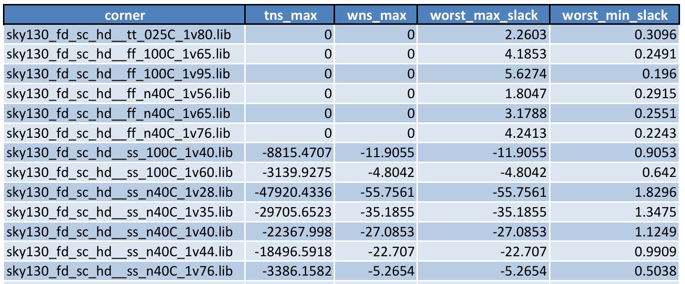


